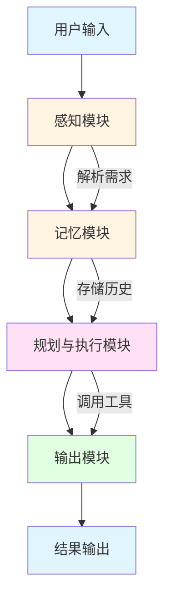
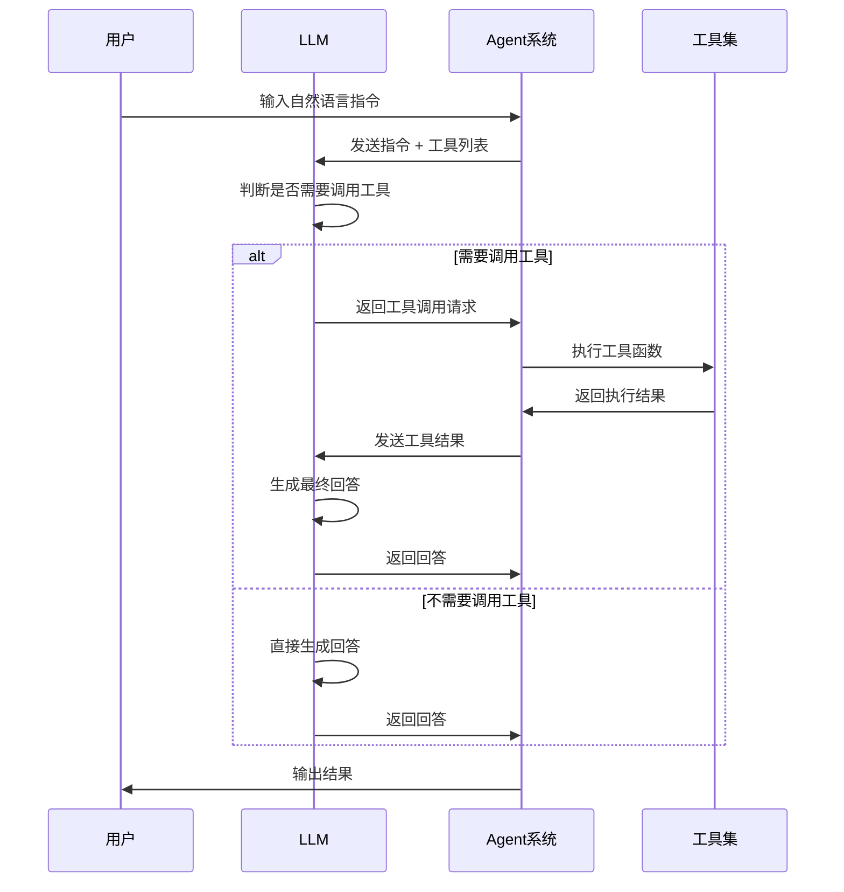
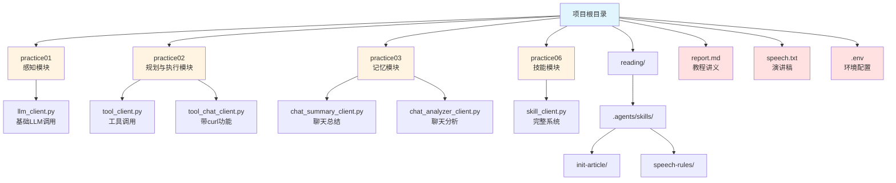
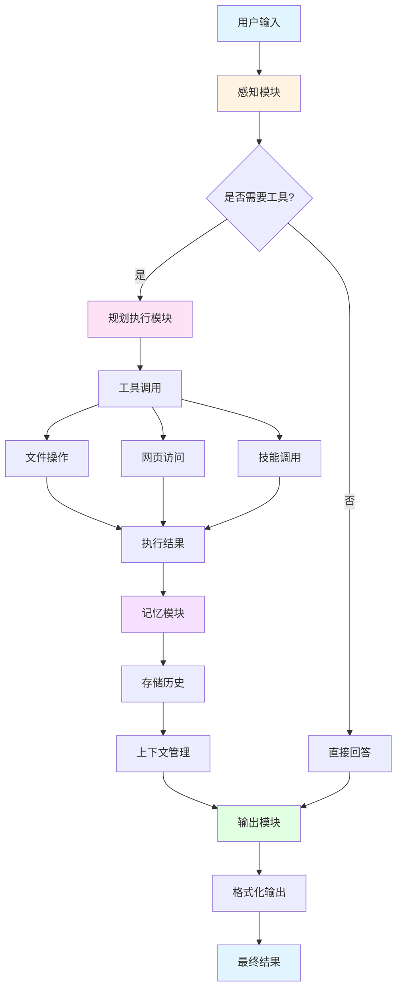
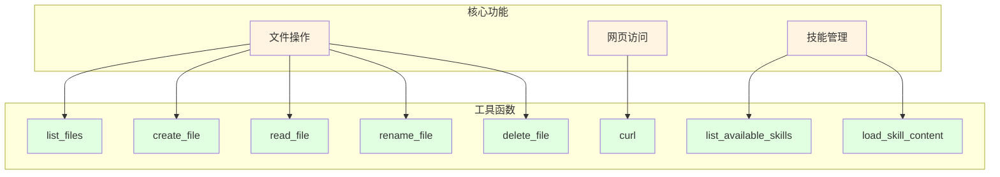
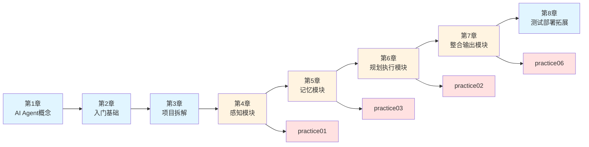

# AI Agent 开发入门教程项目架构图

## 整体架构

```mermaid
graph TB
    Start[用户输入] --> Perception[感知模块]
    Perception --> Memory[记忆模块]
    Memory --> Planning[规划与执行模块]
    Planning --> Output[输出模块]
    Output --> End[结果输出]
    
    Perception --> |解析需求| Memory
    Memory --> |存储历史| Planning
    Planning --> |调用工具| Output
    
    style Start fill:#e1f5ff
    style End fill:#e1f5ff
    style Perception fill:#fff4e1
    style Memory fill:#fff4e1
    style Planning fill:#ffe1f5
    style Output fill:#e1ffe1
```

## 模块详细架构

```mermaid
graph LR
    subgraph "用户层"
        A[用户输入<br/>自然语言指令]
    end
    
    subgraph "感知层"
        B[感知模块<br/>practice01]
        B1[文本预处理]
        B2[LLM分类]
        B3[输出需求类型]
        B --> B1 --> B2 --> B3
    end
    
    subgraph "记忆层"
        C[记忆模块<br/>practice03]
        C1[历史对话存储]
        C2[上下文管理]
        C3[聊天总结]
        C --> C1 --> C2 --> C3
    end
    
    subgraph "规划执行层"
        D[规划与执行模块<br/>practice02]
        D1[工具判断]
        D2[工具选择]
        D3[工具执行]
        D4[结果处理]
        D --> D1 --> D2 --> D3 --> D4
    end
    
    subgraph "技能层"
        E[技能模块<br/>practice06]
        E1[技能加载]
        E2[技能调用]
        E --> E1 --> E2
    end
    
    subgraph "输出层"
        F[输出模块]
        F1[格式化输出]
        F2[友好提示]
        F --> F1 --> F2
    end
    
    A --> B
    B3 --> C
    C3 --> D
    D4 --> E
    E2 --> F
    F2 --> G[最终结果]
    
    style A fill:#e1f5ff
    style G fill:#e1f5ff
    style B fill:#fff4e1
    style C fill:#fff4e1
    style D fill:#ffe1f5
    style E fill:#f5e1ff
    style F fill:#e1ffe1
```

## 工具调用流程

```mermaid
sequenceDiagram
    participant User as 用户
    participant LLM as LLM
    participant Agent as Agent系统
    participant Tools as 工具集
    
    User->>Agent: 输入自然语言指令
    Agent->>LLM: 发送指令 + 工具列表
    LLM->>LLM: 判断是否需要调用工具
    
    alt 需要调用工具
        LLM->>Agent: 返回工具调用请求
        Agent->>Tools: 执行工具函数
        Tools->>Agent: 返回执行结果
        Agent->>LLM: 发送工具结果
        LLM->>LLM: 生成最终回答
        LLM->>Agent: 返回回答
    else 不需要调用工具
        LLM->>LLM: 直接生成回答
        LLM->>Agent: 返回回答
    end
    
    Agent->>User: 输出结果
```

## 项目文件结构

```mermaid
graph TB
    Root[项目根目录]
    
    Root --> P1[practice01<br/>感知模块]
    P1 --> P1a[llm_client.py<br/>基础LLM调用]
    
    Root --> P2[practice02<br/>规划与执行模块]
    P2 --> P2a[tool_client.py<br/>工具调用]
    P2 --> P2b[tool_chat_client.py<br/>带curl功能]
    
    Root --> P3[practice03<br/>记忆模块]
    P3 --> P3a[chat_summary_client.py<br/>聊天总结]
    P3 --> P3b[chat_analyzer_client.py<br/>聊天分析]
    
    Root --> P6[practice06<br/>技能模块]
    P6 --> P6a[skill_client.py<br/>完整系统]
    
    Root --> Reading[reading/]
    Reading --> Skills[.agents/skills/]
    Skills --> Init[init-article/]
    Skills --> Speech[speech-rules/]
    
    Root --> Report[report.md<br/>教程讲义]
    Root --> SpeechFile[speech.txt<br/>演讲稿]
    Root --> Env[.env<br/>环境配置]
    
    style Root fill:#e1f5ff
    style Report fill:#ffe1e1
    style SpeechFile fill:#ffe1e1
    style Env fill:#ffe1e1
    style P1 fill:#fff4e1
    style P2 fill:#fff4e1
    style P3 fill:#fff4e1
    style P6 fill:#fff4e1
```

## 数据流向图

```mermaid
graph TD
    A[用户输入] --> B[感知模块]
    B --> C{是否需要工具?}
    
    C -->|是| D[规划执行模块]
    C -->|否| E[直接回答]
    
    D --> F[工具调用]
    F --> G[文件操作]
    F --> H[网页访问]
    F --> I[技能调用]
    
    G --> J[执行结果]
    H --> J
    I --> J
    
    J --> K[记忆模块]
    K --> L[存储历史]
    L --> M[上下文管理]
    M --> N[输出模块]
    
    E --> N
    N --> O[格式化输出]
    O --> P[最终结果]
    
    style A fill:#e1f5ff
    style P fill:#e1f5ff
    style B fill:#fff4e1
    style D fill:#ffe1f5
    style K fill:#f5e1ff
    style N fill:#e1ffe1
```

## 核心功能模块关系

```mermaid
graph TB
    subgraph "核心功能"
        F1[文件操作]
        F2[网页访问]
        F3[技能管理]
    end
    
    subgraph "工具函数"
        T1[list_files]
        T2[create_file]
        T3[read_file]
        T4[rename_file]
        T5[delete_file]
        T6[curl]
        T7[list_available_skills]
        T8[load_skill_content]
    end
    
    F1 --> T1
    F1 --> T2
    F1 --> T3
    F1 --> T4
    F1 --> T5
    
    F2 --> T6
    
    F3 --> T7
    F3 --> T8
    
    style F1 fill:#fff4e1
    style F2 fill:#fff4e1
    style F3 fill:#fff4e1
    style T1 fill:#e1ffe1
    style T2 fill:#e1ffe1
    style T3 fill:#e1ffe1
    style T4 fill:#e1ffe1
    style T5 fill:#e1ffe1
    style T6 fill:#e1ffe1
    style T7 fill:#e1ffe1
    style T8 fill:#e1ffe1
```

## 学习路径图

```mermaid
graph LR
    A[第1章<br/>AI Agent概念] --> B[第2章<br/>入门基础]
    B --> C[第3章<br/>项目拆解]
    C --> D[第4章<br/>感知模块]
    D --> E[第5章<br/>记忆模块]
    E --> F[第6章<br/>规划执行模块]
    F --> G[第7章<br/>整合输出模块]
    G --> H[第8章<br/>测试部署拓展]
    
    D --> P1[practice01]
    E --> P3[practice03]
    F --> P2[practice02]
    G --> P6[practice06]
    
    style A fill:#e1f5ff
    style B fill:#e1f5ff
    style C fill:#e1f5ff
    style D fill:#fff4e1
    style E fill:#fff4e1
    style F fill:#fff4e1
    style G fill:#fff4e1
    style H fill:#e1f5ff
    style P1 fill:#ffe1e1
    style P2 fill:#ffe1e1
    style P3 fill:#ffe1e1
    style P6 fill:#ffe1e1
```